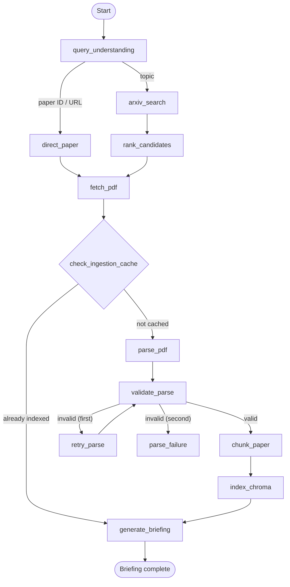
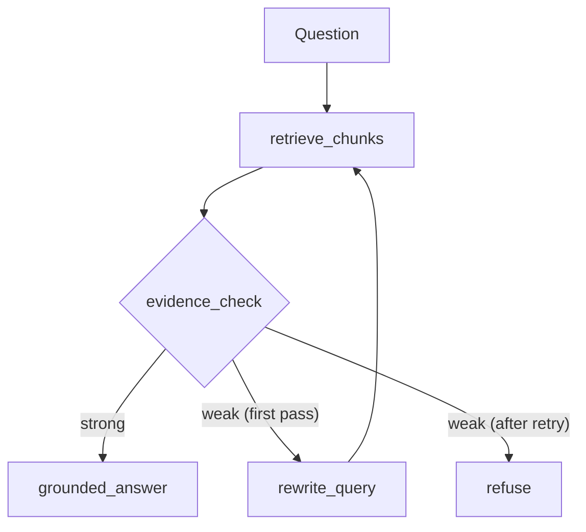

# Autonomous arXiv Paper Digest & QA Agent

A compact Python CLI that turns an arXiv topic or paper ID into a grounded executive briefing and an evidence-cited question-answering session. It uses only the official arXiv Atom API for discovery, PyMuPDF for paper extraction, persistent local Chroma for retrieval, local Sentence Transformers embeddings, and Ollama Cloud for generation.

## Problem and scope

Reading a research paper quickly is hard; answering questions about one without inventing details is harder. This project retrieves one arXiv paper, builds a paper-scoped local knowledge base, produces an evidence-constrained briefing, and refuses QA questions that the extracted paper cannot support. It intentionally is a CLI and does not include a frontend, authentication, non-arXiv discovery, cloud deployment, or a multi-agent system.

## Features

- Accepts a topic, arXiv ID, `/abs/` URL, `/pdf/` URL, or `/html/` URL.
- Calls the official arXiv Atom API; topic results are deduplicated and ranked deterministically.
- Downloads and layout-extracts PDFs with PyMuPDF, detects major headings, and rejects suspiciously sparse extraction.
- Creates section- and paragraph-aware chunks (~800 tokens), retaining paper, section, and page metadata.
- Persists local Chroma vectors and always filters QA retrieval by active `paper_id`.
- **Ingestion caching:** skips the expensive parse → chunk → embed pipeline entirely for papers already in ChromaDB.
- Produces a validated structured briefing with a mandatory limitations section.
- Uses a LangGraph corrective-RAG path for evidence-gated QA and cites readable section/page evidence.
- **Empirically-tuned anti-hallucination gate:** combines vector similarity and lexical coverage with a hard reject for truly off-topic queries.
- Persists lightweight session metadata under `data/sessions`.

## Architecture

### Ingestion graph



### QA graph



### Stateful graph — `AgentState` shape

`AgentState` is the typed hand-off contract—not a dump of every implementation detail. Ingestion reads `user_input` and writes `query_type`, candidate/paper metadata, parsed blocks, chunks, collection name, and `briefing`. It tracks `input_kind`, `html_url`, and `source_type` to route the parser properly. QA reads the selected paper plus `question`, then writes retrieved chunks, evidence score/status, optional rewritten question, answer, and human-facing citations. `retry_count` bounds corrective retrieval; `errors` is reserved for caller-visible failures.

| Node | Responsibility | Main state writes |
| --- | --- | --- |
| `query_understanding` | Normalize direct paper identifiers or recognize a topic | `query_type`, `arxiv_id` |
| `arxiv_search` / `rank_candidates` | Atom query then lexical/recency ranking | `candidates`, `selected_paper` |
| `fetch_pdf` | Download and cache the paper PDF locally | `pdf_path`, `html_url` |
| `check_ingestion_cache` | Skip parse/chunk/embed if paper is already in ChromaDB | `ingestion_cached`, `chunks` (on cache hit) |
| `parse_pdf` → `validate_parse` | Quality-check structured extraction with bounded retry | `parsed_sections`, `parse_valid` |
| `chunk_paper` / `index_chroma` | Preserve evidence metadata in local persistent retrieval | `chunks`, `collection_name` |
| `generate_briefing` | Section-aware evidence synthesis into validated schema | `briefing` |
| `retrieve_chunks` / `evidence_check` | Paper-filtered retrieval and deterministic sufficiency gate | `retrieved_chunks`, `evidence_score`, `evidence_status` |
| `rewrite_query` / `answer` / `refuse` | One corrective pass, grounded answer, or safe refusal | `rewritten_question`, `answer`, `citations` |

## Design choices and tradeoffs

- **LangGraph, not a hand-rolled state machine:** explicit conditional transitions make the evidence gate auditable without overbuilding an orchestration layer.
- **One graph design, not multi-agent:** the task has sequential, focused responsibilities; agents add cost and ambiguity, not value.
- **Official arXiv Atom API:** avoids scraping and keeps the source boundary crisp.
- **Hybrid deterministic ranking:** title overlap (62%), abstract overlap (30%), and a small recency signal (8%) are transparent and cheap for the small result set. An LLM is not needed merely to choose one paper.
- **PyMuPDF:** fast, local, layout-aware blocks are enough for research PDFs. Scanned/poorly encoded PDFs are detected and clearly rejected rather than routed to a large OCR system.
- **Section/paragraph chunking:** maintains citations and semantic boundaries; fixed character windows would split methods and references arbitrarily.
- **Local Sentence Transformers + persistent Chroma:** no paid embedding dependency and no operational database. Chroma metadata filtering prevents Paper A from answering Paper B questions.
- **Ingestion caching:** after the first run, `check_ingestion_cache` queries ChromaDB's metadata index (zero embedding cost) and skips the entire parse → chunk → embed pipeline, eliminating redundant sentence-transformer inference — the dominant per-run latency. Chunks are loaded back from ChromaDB into the state so `generate_briefing` still has its inputs.
- **Empirically-tuned evidence gate:** the initial binary gate (`distance < 0.76 OR coverage > 0.1`) was replaced with a weighted scoring model after end-to-end testing across 10 real arXiv papers. The final gate uses a hard reject (distance ≥ 0.70 AND coverage < 0.10) for truly unrelated content, then computes `0.7 × similarity + 0.3 × coverage ≥ 0.25`. The weights reflect that real researcher questions often paraphrase rather than quote paper terms — so excellent vector similarity alone should pass, while strong keyword overlap can rescue a mediocre distance.
- **Hierarchical-ish section evidence synthesis:** representative evidence from each extracted section is constrained before final JSON synthesis rather than sending a full PDF in one prompt.
- **HTML-first parsing:** HTML is preferred for cleaner document structure when available, while the PDF is always cached as the canonical source artifact and is used as the fallback parser input. Image-only text/scanned content may still fail. OCR is intentionally out of scope. PDF caching is local and ignored by git.
- **Corrective RAG:** one query rewrite recovers terminology mismatches, while a bounded retry and refusal prioritise grounding over fluency.
- **CLI + files:** ideal for a small assessment; sessions and vectors persist without a frontend or relational database.

## Setup

Requires Python 3.11+ and an Ollama Cloud account/model. The initial local embedding model download can be sizeable.

```powershell
cd "C:\building projs\arxiv-digest-agent"
python -m venv .venv
.\.venv\Scripts\Activate.ps1
python -m pip install -r requirements.txt
Copy-Item .env.example .env
```

Set the following in `.env` (never commit it):

Primary intended configuration:
Ollama Cloud

```dotenv
LLM_API_KEY=your_ollama_cloud_key
LLM_MODEL=gpt-oss:120b
LLM_BASE_URL=https://ollama.com/v1
```

> **Validation Note:** The primary Ollama Cloud configuration (`https://ollama.com/v1`) currently returns a `401 Unauthorized` error because the provided API key is unauthorized/revoked. Local evaluation using `http://localhost:11434/v1` passed successfully.

Optional local configuration:

```dotenv
LLM_BASE_URL=http://localhost:11434/v1
LLM_API_KEY=local
LLM_MODEL=gpt-oss:120b-cloud

# Optional:
EMBEDDING_MODEL=all-MiniLM-L6-v2
ARXIV_TIMEOUT_SECONDS=20
```

The application checks `LLM_API_KEY` and `LLM_MODEL` before any expensive work and gives a configuration error when absent. The default `gpt-oss:120b` is selected for strongest structured briefing and grounded-QA quality from the provided free-credit models; switch to `gpt-oss:20b` when latency matters more. LangSmith is deliberately not required or imported; if an environment enables it through its own LangChain configuration, the app still works without it.

## Run

```powershell
python -m app.cli
```

Topic example:

```text
> recent work on KV-cache compression for LLMs
```

Direct-paper examples:

```text
> 2401.12345
> https://arxiv.org/abs/2401.12345
> https://arxiv.org/pdf/2401.12345
```

## Example run

### Input

```text
Enter a topic or arXiv ID/URL:
> 2603.13942
```

### Briefing output (abridged)

```text
EXECUTIVE BRIEFING
------------------------------------------------
Title: KIVI: A Tuning-Free Asymmetric 2bit Quantization for KV Cache
Authors: Zirui Liu, Jiayi Yuan, Hongye Jin, Shaochen Zhong, ...
arXiv: 2603.13942  |  Published: 2024-01-xx

Why this paper matters:
  Transformer inference on long-context LLMs is bottlenecked by KV-cache
  memory. KIVI compresses the cache to 2 bits per element without fine-tuning.

Problem: KV-cache memory grows linearly with sequence length...
Method:
  - Per-channel quantization for keys; per-token for values
  - Sliding window retains recent tokens in full precision
  - Group-size tuning balances accuracy vs. compression

Key claims:
  - 2.6× peak memory reduction with < 0.1 perplexity increase on LLaMA...

Limitations:
  - Evaluated on autoregressive LLMs only; encoder models untested...
  - Hardware-specific gains depend on kernel support...

Suggested follow-up questions:
  1. How does the sliding window size affect accuracy?
  2. What is the latency impact of per-channel vs per-token quantization?
  3. How does KIVI compare to GPTQ or AWQ for KV caches specifically?
```

### Sample QA exchanges

```text
Ask a question:
> How does the method handle the key cache differently from the value cache?

Answer:
The authors apply per-channel quantization to key tensors because key
channels exhibit large-magnitude outliers that dominate the quantization
range. For value tensors, they use per-token quantization since the
distribution is more uniform across tokens but varies across channels.

Evidence:
- Methodology, p. 5

Ask a question:
> What is the perplexity impact on LLaMA-2-13B?

Answer:
Table 2 reports that KIVI with 2-bit KV-cache quantization increases
perplexity by approximately 0.08 on WikiText-2 for LLaMA-2-13B, compared
to the FP16 baseline.

Evidence:
- Key Results, p. 7

Ask a question:
> What is the capital of France?

Answer:
I couldn't find sufficient evidence in the paper to answer that.
```

## Retrieval and grounding

Initial retrieval asks Chroma for eight nearest chunks under `where={"paper_id": active_paper_id}`. The evidence gate combines a hard reject (distance ≥ 0.70 AND coverage < 0.10) with a weighted score (`0.7 × similarity + 0.3 × coverage ≥ 0.25`). Weak evidence triggers one LLM query rewrite and a second retrieval. A second weak result refuses. Generation receives only retrieved excerpts and is instructed not to use external knowledge, invent numbers, or infer unsupported conclusions. Citation formatting uses saved section and page metadata—never vector IDs.

## Failure handling

ArXiv calls retry once on network/XML failures. Invalid IDs, empty topic results, download failures, invalid PDFs, too-little text, malformed briefing JSON (two attempts), unavailable Ollama configuration, empty retrieval, and weak retrieval all return specific safe outcomes. Retries are bounded: there is no unbounded polling or generation loop.

## Tests and evaluation

```powershell
python -m pytest -q
```

Unit tests cover identifier normalization, Atom metadata, ranking, headings, chunk metadata, extraction validation, citations, and evidence gates (strong evidence acceptance, moderate-distance-with-coverage pass-through, empty rejection, truly-off-topic rejection). Integration-style tests exercise parsed blocks → chunks → evidence/citation flow and the refusal contract without calling external services. `evaluation/questions.json` provides factual, methodology, results, limitations, and deliberately unsupported prompts for a real-paper QA run.

## Known limitations / more time

- Heading detection is heuristic; multi-column and unusual paper layouts may need an additional reading-order pass.
- Briefing synthesis samples representative evidence by section to stay bounded; a production system would map-summarize every long section.
- The evidence gate is a weighted heuristic rather than a trained entailment model; a fine-tuned NLI classifier could replace it.
- A real smoke run requires network access, an available Ollama Cloud model, and download of the local embedding model.
- Session files record briefing/history metadata; a `resume` CLI command is a sensible small follow-up.
- The ingestion cache assumes paper content is immutable once indexed; versioned papers (e.g., `v1` → `v2`) would need a cache-invalidation strategy.
